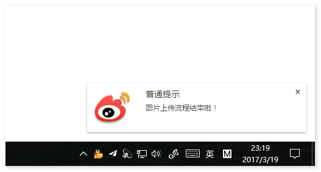
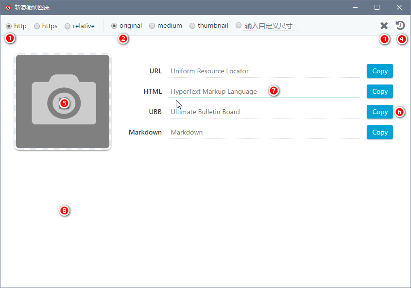
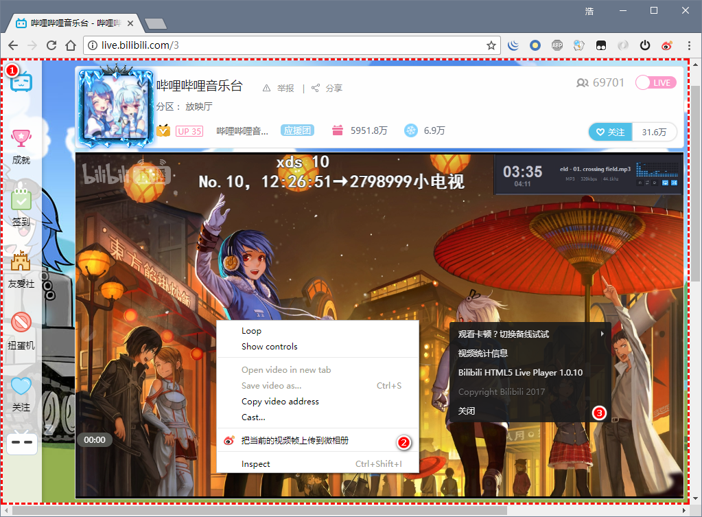
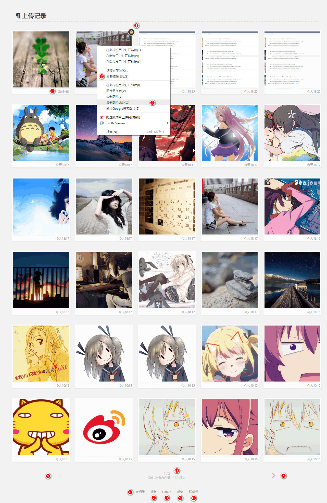

# Weibo-Picture-Store

> [更新日志](changelog.md)

> [Telegram 反馈交流讨论组](https://t.me/Neko_Atsume)

## Introduction

上传图片到微博并生成外链的 Chrome 浏览器扩展

## Feature

> 已下列出的是功能的简介，详情可以继续往下阅读

- 支持点选、拖拽、粘贴以及页面右键菜单上传图片到微博并同步到微相册
- 支持 JPEG、PNG、GIF 三种图片格式
- 支持 BMP、WebP、ico 有损转换为 PNG
- 支持把 HTML5 视频的当前帧上传为 JPG 图像
- 支持查看上传记录，简单的浏览及删除操作
- 支持生成 URL、HTML、UBB、Markdown 四种格式
- 支持单条、多条模式的复制操作
- 支持选择协议（http、https 和相对协议）
- 支持三种固定裁剪尺寸和用户自定义尺寸
- 网页增强功能，实现自定义微博传图，[详见 Powered 部分](#powered)

## Instruction

> 具体的操作指南，包含图示

弹窗属于单例模式，在同一时间只能打开一个。在弹窗处于最小化的情况下，用户再去点击 icon 按钮会出现上图的闪烁提示，表示弹窗已经处于打开状态。（上图是 Windows 10 的提示，不同的操作系统略有差异）

上图展示的是扩展中常用的提示，一般出现在主屏幕的右下角。通常在一定时间后会自动消失，但是有两种提示框需要达到特定条件才会消失。一种是进度条提示，它会在图片上传流程结束自动关闭。另一种是检测到微博没有登录的提示，需要用户按照提示操作或者手动点击关闭。

1. 地址协议选择
2. 图片裁剪选择
3. 在单条和多条复制模式之间切换的按钮
4. 上传记录按钮
7. 选择上传图片的按钮
8. 复制当前类型的地址，批量模式下会复制此类型的所有地址
9. 粘贴区域。弹窗中所有的虚线类型区域在获得焦点，即变绿色后均可以进行粘贴操作
10. 拖拽区域（弹窗任何区域都可以使用）

粘贴区域额外说明：

因为粘贴图片文件实际上是一种相当受限的操作，所以这里的粘贴操作被稍稍的加强了一下。粘贴区域额外的支持粘贴图片地址，可以对其它图片地址上传到微相册提供极大的便利，并且支持换行方式的批量上传操作（支持 Windows、Classic Mac、Unix 三种操作系统的换行符）。

如果可以获取到页面中的图片，则会在右键菜单中显示把这张图片上传到微相册的选项，点击后会自动上传，上传结束后会出现提示。如果上传成功，该图片的地址就自动在剪切板中，可以粘贴使用了。注意：如果在没有结果返回的情况下，用户对另一张图片执行了相同的操作，那么剪切板中最终会是最后成功上传的图片地址。

如果可以获取到页面中 HTML5 的视频并且原生的右键菜单可用，则会在右键菜单中显示把当前的视频帧上传到微相册的选项，上传流程和上述图片一样。

如果页面中 HTML5 视频在其他容器的下层，或者原生的右键菜单被屏蔽了。可以使用默认快捷键 Shift+Alt+T（可在 chrome://extensions 键盘快捷键中修改按键）来修改页面元素，让 HTML5 视频可以被右键菜单捕获并且原生右键菜单这时候处于可用状态。需要注意，在页面元素处于修改状态中，页面上的其他元素不可以被鼠标选中，并且页面周围会显示红白相间的条纹表示页面元素处于修改状态。再次按下快捷键 Shift+Alt+T 即可退出这种状态，恢复正常。

1. 红白相间的条纹提示线
2. 原生的右键菜单
3. 在页面未修改场景下的右键菜单

1. 从相册中移除这张图片（移除后图片的地址依然可以访问）
2. 在图片上右击可以复制图片地址（上面的是复制原图地址，下面的是复制当前显示的图片地址）
3. 图片的创建时间
4. 上一页按钮（禁用状态）
5. 下一页按钮（可用状态）
6. 使用微相册管理这些图片
7. [捐赠](http://git.hub.moe/donate.html)支持一下
8. 在 GitHub 上提交建议或者 Bug
9. 通过电子邮件反馈问题（如果不方便使用 GitHub）
10. ~~使用电子邮件联系我~~
11. 当前的页数和总页数

## Concept

> 如果你想使用好这个插件，那么理解这些词语很重要

以下是针对弹窗模式的说明：

当产生上传流程时，进度条会出现。当上传流程结束时，进度条关闭并提示图片上传流程结束。

弹窗模式最重要的一点是不区分单个文件和多个文件，它们被视为是一样的，那么上传流程如何工作呢？

当上传流程进行中时，弹窗没有被锁死，这个时候用户依然可以继续添加图片，所有图片上传结束后，这些图片会和前面的图片一同出现的列表中。这对小水管用户传大图、多图非常实用。

当上传流程结束后，用户选择继续上传图片，在这些图片上传成功时，已存在的列表会被清空，新的图片会被添加到列表中。如果用户误操作清空了列表，可以通过上传记录来获得以前图片的地址。

微相册命中规则的说明：

- 拉取用户的前 100 个相册
- 检测本地存储的相册 ID 是否在拉取的列表中
- 检测拉取相册中是否带有 64 位特征码的相册

如果上面的步骤没有查找到指定的相册，并且用户当前的相册总数小于 100，那么创建供此插件传图使用的相册（这个相册是属于用户私有，好友不可见的）。

以上条件都不符合，则不会同步图片。

## Additional

已知的自定义裁剪格式：

- large -> 原始图片
- mw690 -> 最大 690 像素宽度裁剪
- thumbnail -> 缩略图
- small -> 小图
- square -> 80 像素正方形裁剪
- thumb150 -> 150 像素正方形裁剪
- thumb180 -> 180 像素正方形裁剪
- thumb300 -> 300 像素正方形裁剪
- orj180 -> 180 像素宽度原比例缩放
- orj360 -> 360 像素宽度原比例缩放
- woriginal -> 原图，和 large 一样
- bmiddle -> 440 像素宽度原比例缩放
- wap50 -> 50 像素宽度原比例缩放
- wap180 -> 180 像素宽度原比例缩放
- wap240 -> 240 像素宽度原比例缩放
- wap360 -> 360 像素宽度原比例缩放
- wap720 -> 720 像素宽度原比例缩放
- wap800 -> 800 像素宽度原比例缩放
- crop.x.y.x1.y1.w -> 自定义矩形裁剪，其中 x, y 表示左上角坐标，x1, y1 表示右下角坐标，w 是宽度

## FAQ

- 图片上传到哪儿了？
    + 上传到微博上了
- 可以上传的最大图片大小是多少？
    + 目前是 20MB
- 如何管理已上传的图片？
	+ 上传记录或者微相册均可以管理
- 如何删除已上传的图片？
    + 目前无法删除，微相册中的删除是针对相册的操作，对图片本身没有影响
- JPG 和 JPEG 有什么区别？
	+ JPEG 是图片格式，JPG 是 JPEG 图片格式常用的一种文件扩展名
- 粘贴上传没有效果？
    + 粘贴上传只支持复制图片文件，在资源文件管理器中的复制文件并粘贴是没有效果的
- 上传的是 PNG 图片，返回的却是 JPG 后缀的地址？
    + 微博不支持 PNG 后缀，后缀对于浏览器判断图片的格式是没有影响的
- 如何使用自定义裁剪？
	+ 自定义裁剪的格式需要微博支持，否则生成的地址是不能正常问的
- 裁剪操作对图片的影响？
	+ 裁剪适用于 JPEG 格式的图片。PNG 图片裁剪后会丢失透明通道，GIF 则会变成静态图片
- 删除一张图片且页面刷新后，页面上的图片数量少了一个？
    + 属于正常情况，服务器返回的数据时效性不足，脚本做了些弥补，因此会出现这种情况
- 微相册同步图片的最大数量是多少？
    + 1000 张。如果达到这个数量后继续使用，则会删除早前的 50 张图片
- 微博处于已登录状态，为什么上传图片失败了？
    + 可能是其他 Chrome 插件造成的。解决方案：停用相关插件，并退出微博重新登录一次
    + 详情参考 [Issues#37](https://github.com/Aqours/Weibo-Picture-Store/issues/37)
- Errors: Failed to load module script: The server responded with...
    + [下载此文件](https://github.com/Aqours/Weibo-Picture-Store/blob/master/scratch/reset-content-type.reg)，双击运行更新注册表即可（Windows 操作系统可用）
    + 详情参考 [Issues#762483](https://bugs.chromium.org/p/chromium/issues/detail?id=762483#c7)

## Powered

> Tampermonkey 的扩展（在 extension 文件夹下）

高阶用法，请查看[示例说明](example/tampermonkey.js)

V2EX 回复框增加微博贴图功能效果：

## Extension

> 此扩展相关的 Tampermonkey 脚本（点击即可打开安装页面）

- [V2EX 回复框自动贴图](https://greasyfork.org/zh-CN/scripts/34096-添加-v2ex-回复框自动贴图的功能)

## Thanks

- [@Suxiaogang](https://github.com/Suxiaogang/WeiboPicBed/)（参考了某些交互设计）
