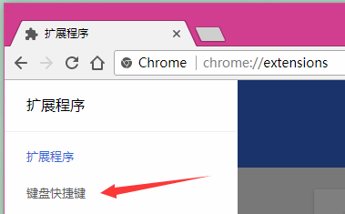
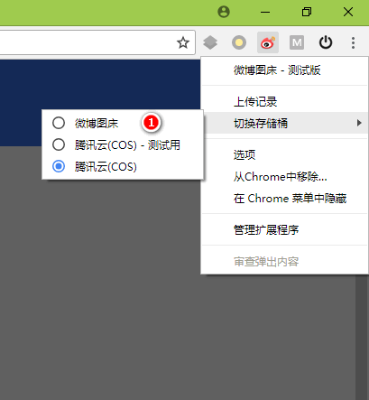

# Weibo-Picture-Store

> [更新日志](changelog.md)

> [安装测试版](https://chrome.google.com/webstore/detail/fgojeheijgbiibpekigaajhpendcghpi)

## Introduction

> 存储桶泛指微博相册、腾讯云存储(COS)等扩展支持的存储空间

上传图片到存储桶并生成外链的 Chrome 浏览器扩展

## Feature

> 已下列出的是功能的简介，详情可以继续往下阅读

- 支持点选、拖拽、粘贴以及页面右键菜单上传图片到微博并同步到存储桶
- 支持 JPEG、PNG、GIF 三种图片格式（仅限微博）
- 支持 BMP、WebP、ico 有损转换为 PNG（仅限微博）
- 支持把 HTML5 视频的当前帧上传为 JPG 图像
- 支持查看上传记录，简单的浏览及删除操作
- 支持生成 URL、HTML、UBB、Markdown 四种格式
- 支持单条、多条模式的复制操作
- 支持选择协议（http、https 和相对协议）
- 支持三种固定裁剪尺寸和用户自定义尺寸

## Instruction

> 具体的操作指南，包含图示

上图展示的是扩展中常用的提示，一般出现在主屏幕的右下角。通常在一定时间后会自动消失，但是有两种提示框需要达到特定条件才会消失。一种是进度条提示，它会在图片上传流程结束自动关闭。另一种是检测到微博没有登录的提示，需要用户按照提示操作或者手动点击关闭。

1. 地址协议选择
2. 图片裁剪选择
3. 在单条和多条复制模式之间切换的按钮
4. 上传记录按钮
5. 选择上传图片的按钮
6. 复制当前类型的地址，批量模式下会复制此类型的所有地址
7. 粘贴区域及拖拽区域，弹窗任何区域都可以使用（这里可以批量粘贴图片链接）
8. 隐藏菜单，用于放置反馈及其他信息（图中是菜单展开状态）
9. 在 GitHub 上提交建议或者 BUG
10. 通过电子邮件反馈问题（如果不方便使用 GitHub）
11. [捐赠](http://www.hub.moe/blackboard/donate.html)支持一下
12. 查看简要的更新日志

如果可以获取到页面中的图片，则会在右键菜单中显示把这张图片上传到存储桶的选项，点击后会自动上传，上传结束后会出现提示。

如果可以获取到页面中 HTML5 的视频并且原生的右键菜单可用，则会在右键菜单中显示把当前的视频帧上传到存储桶的选项，上传流程和上述图片一样。

如果页面中 HTML5 视频在其他容器的下层，或者原生的右键菜单被屏蔽了。可以使用默认快捷键 Shift+Alt+T（如果没有效果，则需要在 chrome://extensions 键盘快捷键中手动添加快捷键）来修改页面元素，让 HTML5 视频可以被右键菜单捕获并且原生右键菜单这时候处于可用状态。需要注意，在页面元素处于修改状态中，页面上的其他元素不可以被鼠标选中，并且页面周围会显示红白相间的条纹表示页面元素处于修改状态。再次按下快捷键 Shift+Alt+T 即可退出这种状态，恢复正常。

1. 红白相间的条纹提示线
2. 原生的右键菜单
3. 在页面未修改场景下的右键菜单

1. 从存储桶中移除这张图片
2. 在图片上右击可以复制图片地址
3. 批量删除选中的文件（按住 Ctrl 键可以多选）
4. 图片最近的修改时间

1. 选择存储桶的 Tab
2. 当前的存储桶配置数据（[查看详细的设置教程](http://blog.hub.moe/posts/cos-setting-tutorial/)）
    - 备注：就是备注的意思
    - AccessKey：就是腾讯云存储后台显示的 SecretId
    - SecretKey：腾讯云存储后台显示的 SecretKey
    - BucketHost：腾讯云存储的 Host
    - Path：可选设置文件存储的路径
    - PictureHost：可选设置万象优图的 Host

- 更换当前存储桶的快捷菜单（这个选中和选项页中的 Tab 是同步的）

## Concept

> 如果你想使用好这个插件，那么理解这些词语很重要（仅限微博）

以下是针对弹窗模式的说明：

当产生上传流程时，进度条会出现。当上传流程结束时，进度条关闭并提示图片上传流程结束。

弹窗模式最重要的一点是不区分单个文件和多个文件，它们被视为是一样的，那么上传流程如何工作呢？

当上传流程进行中时，弹窗没有被锁死，这个时候用户依然可以继续添加图片，所有图片上传结束后，这些图片会和前面的图片一同出现的列表中。这对小水管用户传大图、多图非常实用。

当上传流程结束后，用户选择继续上传图片，在这些图片上传成功时，已存在的列表会被清空，新的图片会被添加到列表中。如果用户误操作清空了列表，可以通过上传记录来获得以前图片的地址。

微相册命中规则的说明：

- 拉取用户的前 100 个相册
- 检测本地存储的相册 ID 是否在拉取的列表中
- 检测拉取相册中是否带有 64 位特征码的相册

如果上面的步骤没有查找到指定的相册，并且用户当前的相册总数小于 100，那么创建供此插件传图使用的相册（这个相册是属于用户私有，好友不可见的）。

以上条件都不符合，则不会同步图片。

## Additional

已知微博图片的自定义裁剪格式：

- large -> 原始图片
- mw690 -> 最大 690 像素宽度裁剪
- thumbnail -> 缩略图
- small -> 小图
- square -> 80 像素正方形裁剪
- thumb150 -> 150 像素正方形裁剪
- thumb180 -> 180 像素正方形裁剪
- thumb300 -> 300 像素正方形裁剪
- orj180 -> 180 像素宽度原比例缩放
- orj360 -> 360 像素宽度原比例缩放
- woriginal -> 原图，和 large 一样
- bmiddle -> 440 像素宽度原比例缩放
- wap50 -> 50 像素宽度原比例缩放
- wap180 -> 180 像素宽度原比例缩放
- wap240 -> 240 像素宽度原比例缩放
- wap360 -> 360 像素宽度原比例缩放
- wap720 -> 720 像素宽度原比例缩放
- wap800 -> 800 像素宽度原比例缩放
- crop.x.y.x1.y1.w -> 自定义矩形裁剪，其中 x, y 表示左上角坐标，x1, y1 表示右下角坐标，w 是宽度

## FAQ

- 可以上传的最大图片大小是多少？
    + 目前是 20MB（仅限微博）
- 如何删除已上传的图片？
    + 目前无法删除，微相册中的删除是针对相册的操作，对图片本身没有影响（仅限微博）
- 粘贴上传没有效果？
    + 粘贴上传只支持复制图片文件，在资源文件管理器中的复制文件并粘贴是没有效果的
- 上传的是 PNG 图片，返回的却是 JPG 后缀的地址？
    + 微博不支持 PNG 后缀，后缀对于浏览器判断图片的格式是没有影响的（仅限微博）
- 如何使用自定义裁剪？
	+ 自定义裁剪的格式需要微博支持，否则生成的地址是不能正常问的
- 裁剪操作对图片的影响？
	+ 裁剪适用于 JPEG 格式的图片。PNG 图片裁剪后会丢失透明通道，GIF 则会变成静态图片
- 微相册同步图片的最大数量是多少？
    + 1000 张。如果达到这个数量后继续使用，则会删除早前的 50 张图片

## Thanks

- [JetBrains IDEs](https://www.jetbrains.com/)
- [Font Awesome](https://fontawesome.com/)
- [Base64 encode/decode](https://github.com/beatgammit/base64-js)
- [MD5 Algorithm](http://pajhome.org.uk/crypt/md5/index.html)
- [@Suxiaogang](https://github.com/Suxiaogang/WeiboPicBed/)（参考了某些交互设计）
