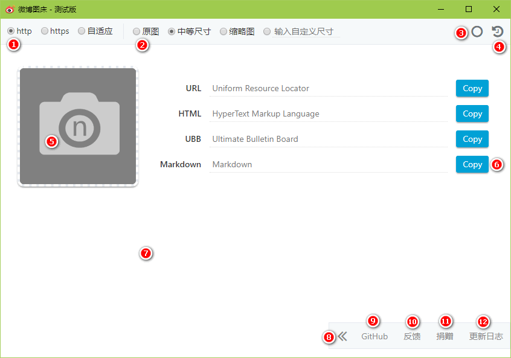
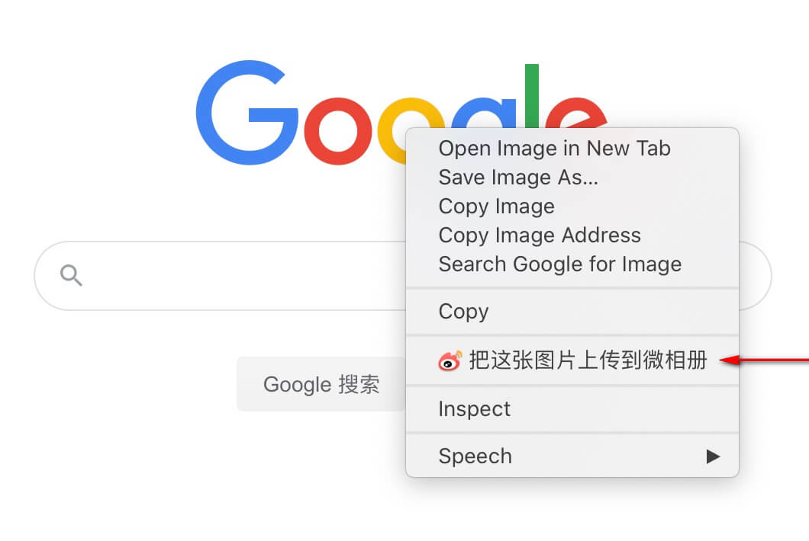
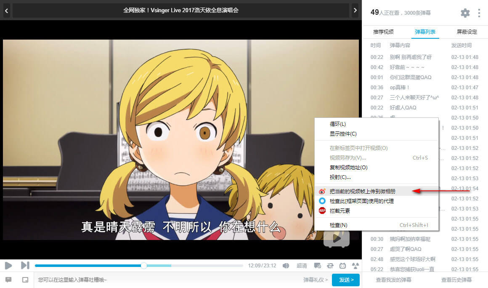
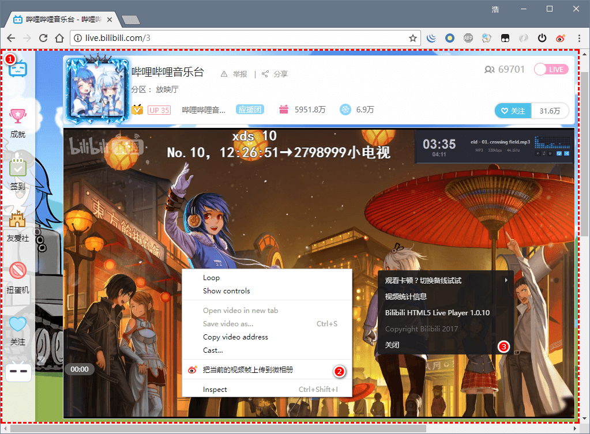
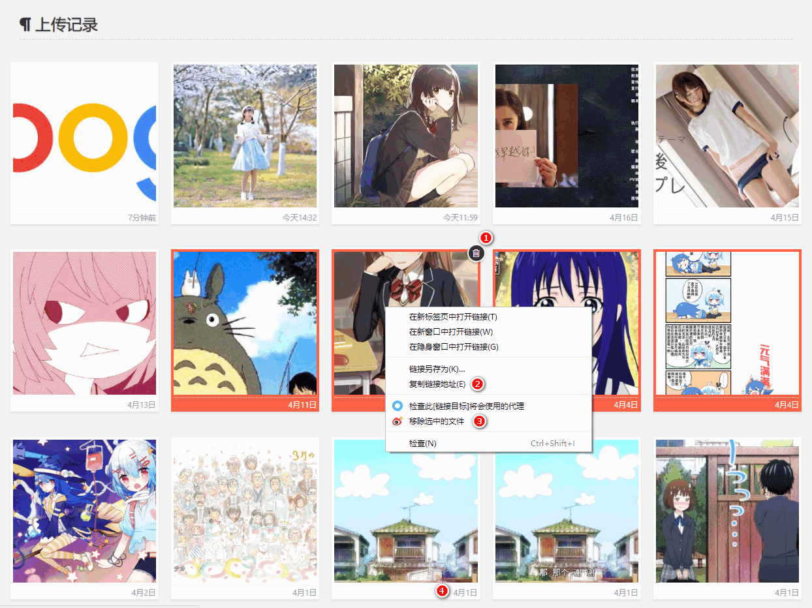
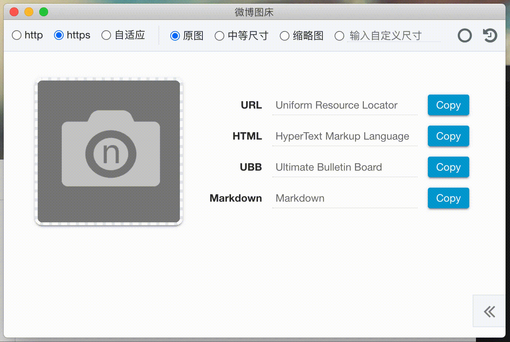
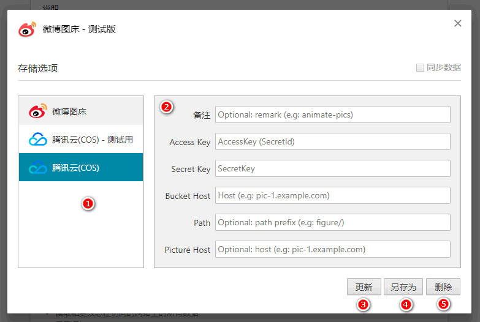

# Weibo-Picture-Store

[更新日志(CHANGELOG)](changelog.md)

## Introduction

上传图片到微博并生成外链的 Chrome 浏览器扩展

## Feature

> 已下列出的是功能的简介，详情可以继续往下阅读

-   支持点选、拖拽、粘贴以及页面右键菜单上传图片到微博并同步到微相册
-   支持拖拽上传文件夹中的图片文件
-   支持 JPEG、PNG、GIF 三种图片格式
-   支持 SVG、BMP、WebP、ico 有损转换为 PNG
-   支持把 HTML5 视频的当前帧上传为 JPG 图像
-   支持查看上传记录，简单的浏览及删除操作
-   支持生成 URL、HTML、UBB、Markdown 四种格式
-   支持单条、多条模式的复制操作
-   支持选择协议（http、https 和相对协议）
-   支持三种固定裁剪尺寸和用户自定义尺寸
-   支持使用微博账号和密码自动登录

## Instruction

> 具体的操作指南，包含图示

上图展示的是扩展中常用的提示，一般出现在主屏幕的右下角，不同的操作系统显示上略有差异。

1. 地址协议选择
2. 图片裁剪选择
3. 在单条和多条复制模式之间切换的按钮
4. 上传记录按钮
5. 选择上传图片的按钮
6. 复制当前类型的地址，批量模式下会复制此类型的所有地址
7. 粘贴区域及拖拽区域，弹窗任何区域都可以使用（这里可以批量粘贴图片链接）
8. 隐藏菜单，用于放置反馈及其他信息（图中是菜单展开状态）
9. 在 GitHub 上提交建议或者 BUG
10. 通过电子邮件反馈问题（如果不方便使用 GitHub）
11. [捐赠](https://www.hub.moe/blackboard/donate.html)支持一下
12. 查看更新日志

如果可以获取到页面中的图片，则会在右键菜单中显示把这张图片上传到微相册的选项，点击后会自动上传，上传结束后会出现提示。

如果可以获取到页面中 HTML5 的视频并且原生的右键菜单可用，则会在右键菜单中显示把当前的视频帧上传到微相册的选项，上传流程和上述图片一样。

如果页面中 HTML5 视频在其他容器的下层，或者原生的右键菜单被屏蔽了。可以使用默认快捷键 `Alt+Shift+T`（可在 `chrome://extensions/shortcuts` 键盘快捷键中修改按键）来修改页面元素，让 HTML5 视频可以被右键菜单捕获并且原生右键菜单这时候处于可用状态。需要注意，在页面元素处于修改状态中，页面上的其他元素不可以被鼠标选中，并且页面周围会显示红白相间的条纹表示页面元素处于修改状态。再次按下快捷键 `Alt+Shift+T` 即可退出这种状态，恢复正常。

1. 红白相间的条纹提示线
2. 原生的右键菜单
3. 在页面未修改场景下的右键菜单

1. 从微相册中移除这张图片
2. 在图片上右击可以复制图片地址
3. 批量删除选中的文件（按住 Ctrl 键可以多选）
4. 图片最近的修改时间
5. 切换相册（不可用状态）
6. 切换相册（可用状态）

上图是拖拽文件夹上传图片的示例。

上图是选项设置，填写微博的账号和密码，可以在传图时自动登录到你的微博，这是可选的设置。默认情况下，使用浏览器中微博的 Cookies，如果你的微博没有登录，则会收到需要登录微博的提示。

## More

-   [深入了解概念](docs/conception.md)
-   [自定义剪裁格式](docs/custom-clipsize.md)
-   [获得/生成 CRX 文件](docs/get-crx-file.md)
-   [已知问题](docs/known-issues.md)
-   [项目结构预览(开发者文档)](docs/project-structure.md)
-   [基础架构预览(开发者文档)](docs/architecture.md)

## FAQ

-   图片上传到哪儿了？
    -   上传到用户的微博上了
-   在扩展中填写微博账号和密码，这样做是否安全？
    -   你填写的账号和密码存在本地，不会上传到任何服务器上
-   我的常用微博账号是**A**，我可以在扩展中填写另一个账号**B**吗？
    -   可以但不推荐，因为一个浏览器同时只能有一个微博的登录状态，在使用**B**时，**A**可能会被强制登出
    -   若有同时登录两个账户的需求，请使用 [Chrome 的多用户模式](https://support.google.com/chrome/answer/2364824?hl=zh-Hans)来避免上述这种情况
-   可以上传的最大图片大小是多少？
    -   目前是 20MB
-   如何设置微博图片水印？
    -   请参考[官方教程](https://weibo.com/ttarticle/p/show?id=2309404137032606682721)设置微博图片水印
-   如何管理已上传的图片？
    -   上传记录或者微相册均可以管理
-   如何删除已上传的图片？
    -   目前无法删除，微相册中的删除是针对相册的操作，对图片本身没有影响
-   粘贴上传没有效果？
    -   粘贴上传只支持复制图片文件，在资源文件管理器中的复制文件并粘贴是没有效果的
-   上传的是 PNG 图片，返回的却是 JPG 后缀的地址？
    -   微博不支持 PNG 后缀，后缀对于浏览器判断图片的格式是没有影响的
-   如何使用自定义裁剪？
    -   自定义裁剪的格式需要微博支持，否则生成的地址是不能访问的
-   裁剪操作对图片的影响？
    -   裁剪适用于 JPEG 格式的图片。PNG 图片裁剪后会丢失透明通道，GIF 则会变成静态图片
-   微相册同步图片的最大数量是多少？
    -   1000 张。如果达到这个数量后继续使用，会创建新的相册，如果相册也满了，则不再同步图片
-   微相册数量已达到上限 100 个，不能同步图片了怎么办？
    -   前往[微相册](http://photo.weibo.com)清理陈旧的相册即可
-   为什么通过复制粘贴的方式上传 GIF 会变成静态图片？
    -   在浏览器或操作系统中复制 GIF 时，只有其中一帧被复制到了剪切板，因此上传后会变成静态图片

## Thanks

-   [JetBrains IDEs](https://www.jetbrains.com/?from=Weibo-Picture-Store)
-   [Font Awesome](https://fontawesome.com/)
-   [Base64 encode/decode](https://github.com/beatgammit/base64-js)
-   [@Suxiaogang](https://github.com/Suxiaogang/WeiboPicBed/)（参考了某些交互设计）

  

